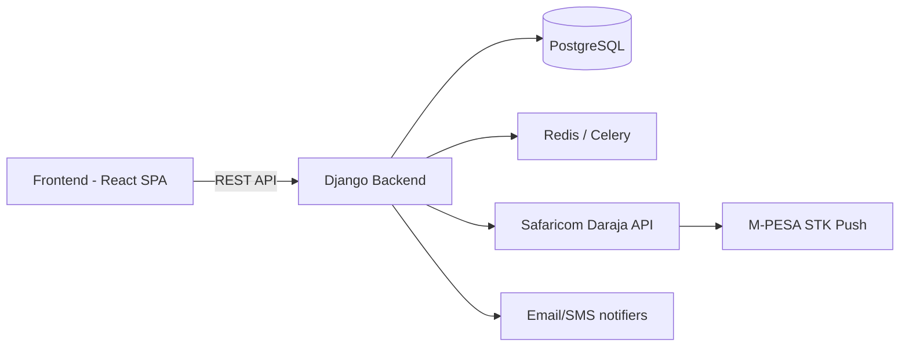

# SmartRent — Kenyan Rental Management System

A full‑stack property management platform built for the Kenyan rental ecosystem. Streamlines rent collection, arrears tracking, maintenance, and M‑PESA payments for estates, houses, and rooms.

##  Table of Contents

- [Overview](#overview)
- [Features](#features)
- [Tech Stack](#tech-stack)
- [Architecture](#architecture)
- [Prerequisites](#prerequisites)
- [Installation & Setup](#installation--setup)
  - [Backend](#2-backend-setup)
  - [Frontend](#3-frontend-setup)
  - [Celery & Redis](#4-celery--redis-optional-for-invoice-automation)
- [Environment Variables](#environment-variables)
- [Database Seeding](#database-seeding)
- [M‑PESA Integration](#mpesa-integration)
- [API Reference](#api-reference)
- [Testing Credentials](#testing-credentials)
- [Deployment](#deployment)
- [Contributing](#contributing)
- [License](#license)

## Overview

SmartRent is a purpose‑built solution for managing rental properties in Kenya. It supports a three‑tier user hierarchy:

- **Super Admin** – Full system control.
- **Estate Manager** – Manages estates, houses, and tenants.
- **Main Tenant** – Manages their assigned house(s) and sub‑tenants.
- **Sub‑Tenant** – Views and pays their own rent.

The system automates invoice generation, integrates Safaricom M‑PESA STK Push for payments, and provides real‑time arrears dashboards and maintenance ticketing.

## Features

-  **Role‑Based Access Control** – Different dashboards and permissions per user type.
-  **Property Hierarchy** – Manage Estates → Houses → Rooms with occupancy status.
-  **Lease & Invoice Automation** – Monthly invoices generated automatically based on lease rent‑due‑day.
-  **M‑PESA STK Push** – Tenants pay rent via phone; callback updates invoice status.
-  **Arrears Dashboard** – Filter overdue, paid, and total invoices with "Pay Now" actions.
-  **Maintenance Tickets** – Sub‑tenants report issues; Main Tenants/Admins update status.
-  **Mobile‑First PWA** – Fully responsive, works offline, installable on smartphones.
-  **Celery Beat** – Scheduled daily invoice generation at midnight.

## Tech Stack

| Layer | Technologies |
|---|---|
| Backend | Django 4.2+, Django REST Framework, Simple JWT, Celery, Redis |
| Database | PostgreSQL (dev: SQLite) |
| Payments | Safaricom Daraja API (M‑PESA) |
| Frontend | React 18, Vite, Tailwind CSS, Heroicons |
| Task Queue | Celery + Redis (invoice generation, reminders) |
| Deployment | Gunicorn, Nginx, Docker optional |

## Architecture



- Frontend (Vite + React) proxies API requests to the Django backend.
- Django provides REST endpoints, authentication, and business logic.
- Celery handles background tasks (invoice generation, payment status polling).
- Redis is the message broker for Celery.
- M‑PESA callbacks are handled by a dedicated endpoint exposed via ngrok (dev) or HTTPS (prod).

## Prerequisites

- Python 3.10+
- Node.js 18+
- Redis server (local or via Docker)
- ngrok (for receiving M‑PESA callbacks in development)
- Safaricom Developer Account (for Daraja API credentials)

## Installation & Setup

### 1. Clone the Repository

```bash
git clone https://github.com/yourusername/smartrent.git
cd smartrent
```

### 2. Backend Setup

```bash
cd backend
python -m venv venv
source venv/bin/activate      # On Windows: venv\Scripts\activate
pip install -r requirements.txt
```

Create a `.env` file in the `backend/` directory (see [Environment Variables](#environment-variables)).

Run migrations and start the server:

```bash
python manage.py migrate
python manage.py runserver
```

### 3. Frontend Setup

```bash
cd ../frontend
npm install
npm run dev
```

The frontend will be available at `http://localhost:5173`.

### 4. Celery & Redis (optional for invoice automation)

Start Redis (if not already running). On Windows, use WSL or Docker; on Linux/macOS use `redis-server`.

```bash
# In a new terminal
cd backend
celery -A config worker --loglevel=info
celery -A config beat --loglevel=info
```

## Environment Variables

Create a `.env` file inside `backend/` with the following keys:

```env
# Django
DJANGO_SECRET_KEY=your-secret-key
DJANGO_DEBUG=True
ALLOWED_HOSTS=localhost,127.0.0.1

# Database
DB_NAME=smartrent_db
DB_USER=postgres
DB_PASSWORD=yourpassword
DB_HOST=localhost
DB_PORT=5432

# M-PESA
MPESA_CONSUMER_KEY=your_consumer_key
MPESA_CONSUMER_SECRET=your_consumer_secret
MPESA_PASSKEY=your_passkey
MPESA_SHORTCODE=174379              # or your registered shortcode
MPESA_ENVIRONMENT=sandbox           # sandbox or production
MPESA_CALLBACK_URL=https://your-ngrok-url.ngrok.io/api/payments/mpesa-callback/

# Celery (optional, Redis default)
REDIS_URL=redis://localhost:6379/0
```

> **Note:** For production, set `DJANGO_DEBUG=False` and use a proper database.

## Database Seeding

To populate the database with sample data (users, estates, houses, rooms, leases, invoices, and maintenance tickets), run the seed script (provided in the repository). From the `backend/` directory:

```bash
python manage.py shell < seed_data.py
```

Alternatively, the seeder command is available as a one‑liner in the documentation. It creates:

- 1 Super Admin (`admin`)
- 1 Estate Manager (`estate_manager`)
- 3 Main Tenants (`main_tenant1..3`)
- 6 Sub Tenants (`sub_tenant1..6`)
- 2 Estates, 6 Houses, 12 Rooms
- Leases and invoices (paid, overdue, pending)
- Maintenance tickets (if maintenance app is installed)

## M‑PESA Integration

1. Register your application on the [Safaricom Developer Portal](https://developer.safaricom.co.ke/).
2. Obtain Consumer Key, Consumer Secret, and Passkey.
3. Set `MPESA_ENVIRONMENT=sandbox` for testing.
4. Use ngrok to expose your local callback endpoint:

   ```bash
   ngrok http 8000
   ```

5. Set `MPESA_CALLBACK_URL` in `.env` to your ngrok HTTPS URL + `/api/payments/mpesa-callback/`.

In the frontend, sub‑tenants can initiate STK Push payments by selecting an invoice and entering their phone number. The callback updates the transaction and invoice status.

## API Reference

All endpoints are prefixed with `/api/`.

| Endpoint | Description |
|---|---|
| `/auth/` | Registration, login, JWT refresh, profile |
| `/properties/` | Estates, Houses, Rooms (CRUD, filtering) |
| `/leasing/` | LeaseAgreements and Invoices (auto‑generation) |
| `/payments/` | M‑PESA STK Push, transaction status |
| `/maintenance/` | Maintenance tickets (CRUD, status updates) |

Detailed request/response schemas are available in the Postman collection (link to be provided) or via browsable API at `/api/` when `DEBUG=True`.

## Testing Credentials

| Role | Username | Password |
|---|---|---|
| Super Admin | `admin` | `Admin@123` |
| Estate Manager | `estate_manager` | `Manager@123` |
| Main Tenant | `main_tenant1` | `Tenant@123` |
| Sub Tenant | `sub_tenant1` | `Tenant@123` |

You can use these to log in to the frontend and explore the full functionality.

## Deployment

### Production Backend (Gunicorn + Nginx)

```bash
pip install gunicorn
gunicorn config.wsgi:application --bind 0.0.0.0:8000
```

Configure Nginx to proxy requests to Gunicorn and serve static/media files.

### Frontend Build

```bash
cd frontend
npm run build
```

Serve the `dist/` folder via Nginx or use a static hosting service.

### Celery in Production

Run Celery workers with `--loglevel=info` and consider using systemd or supervisor.

## Contributing

1. Fork the repository.
2. Create a feature branch.
3. Write clear, documented code.
4. Submit a pull request with a detailed description.

All contributions are welcome!

## License

This project is open‑source and available under the [MIT License](LICENSE).

## Acknowledgements

- Safaricom for the Daraja API.
- Django and Django REST Framework teams.
- React and Vite communities.

Built with  for the Kenyan rental ecosystem.
